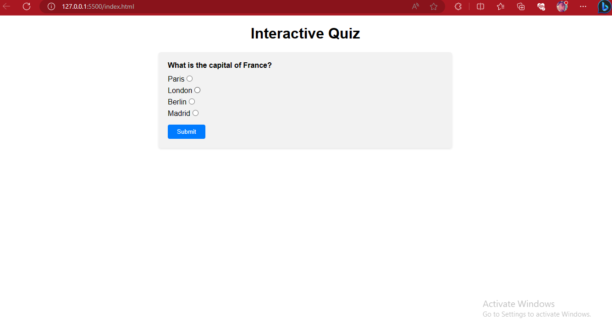
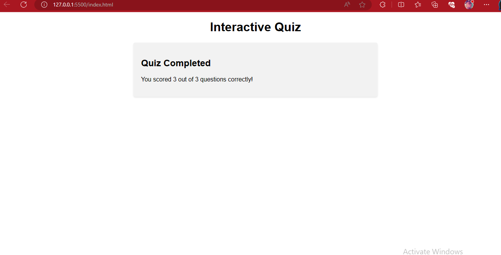

# Interactive Quiz



## Description

Interactive Quiz is a web application that presents users with a series of multiple-choice questions and provides instant feedback on their answers. It is built using HTML, CSS, and JavaScript and designed to test users' knowledge on various topics.

## Features

- Dynamic presentation of questions and answer options
- Real-time feedback on user-selected answers
- Calculation of the final score upon quiz completion

## Live Demo

Check out the live demo [https://interactive-quiz-theta.vercel.app/](#).

## Installation and Setup

1. Clone the repository or download the ZIP file.

<!-- ```bash
git clone [https://github.com/Olamiposi-cloud-coder/Interactive_Quiz.git] -->

    
   
## Usage

- Open the web application in your browser.
- Click the "Start Quiz" button to begin the quiz.
- Read each question carefully and select your answer from the provided options.
- Click the "Submit" button to proceed to the next question.
- After answering all the questions, the quiz will display your final score.

## Screenshots




## Technologies Used

1. HTML5
2. CSS3
3. JavaScript

## Contributing

Contributions are welcome! If you find any issues or have suggestions for improvement, please submit a pull request.
License

## This project is licensed under the MIT License.
Acknowledgments